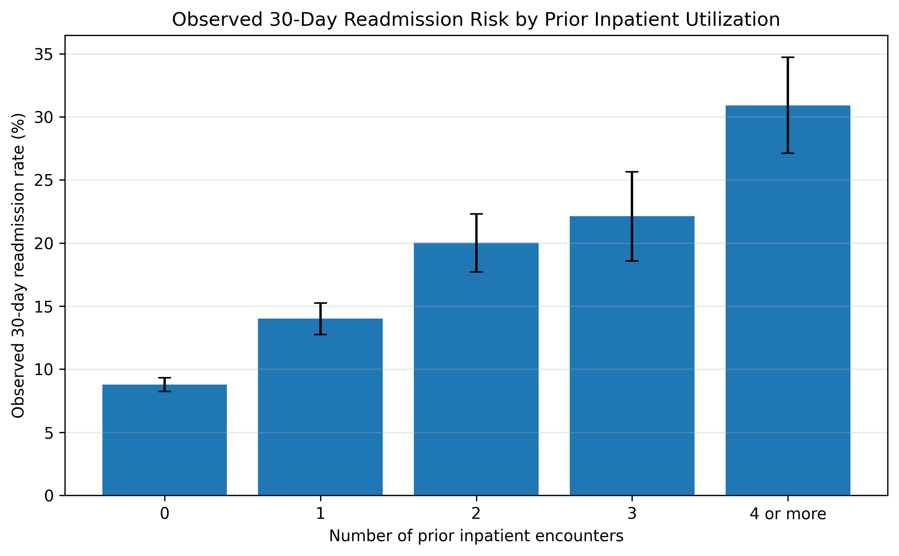
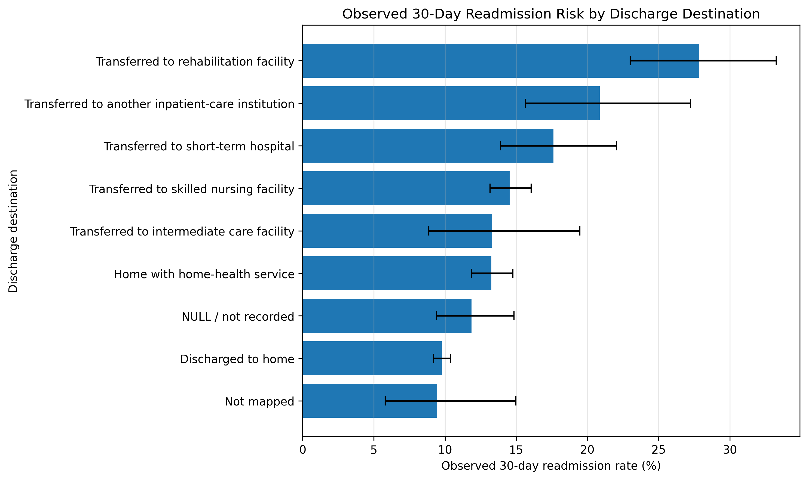
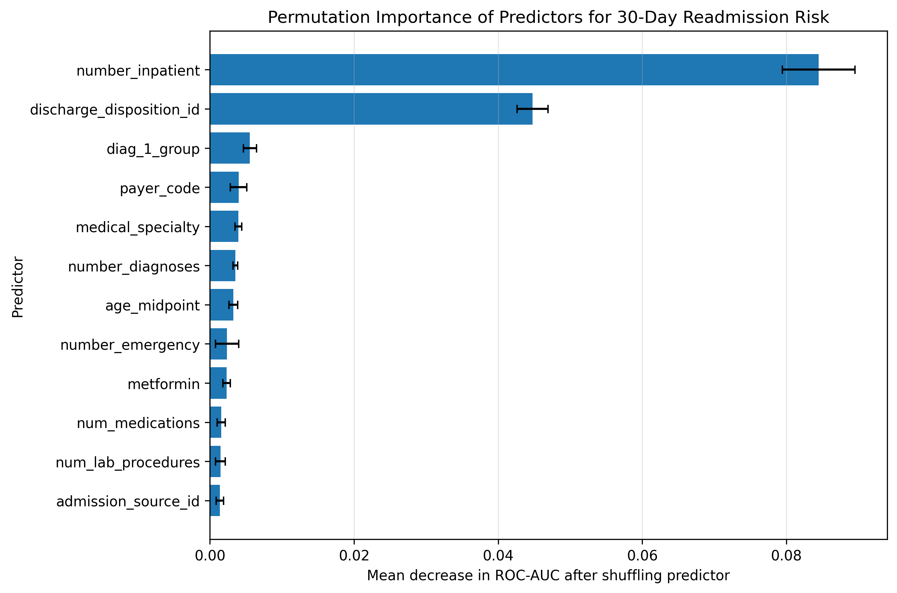
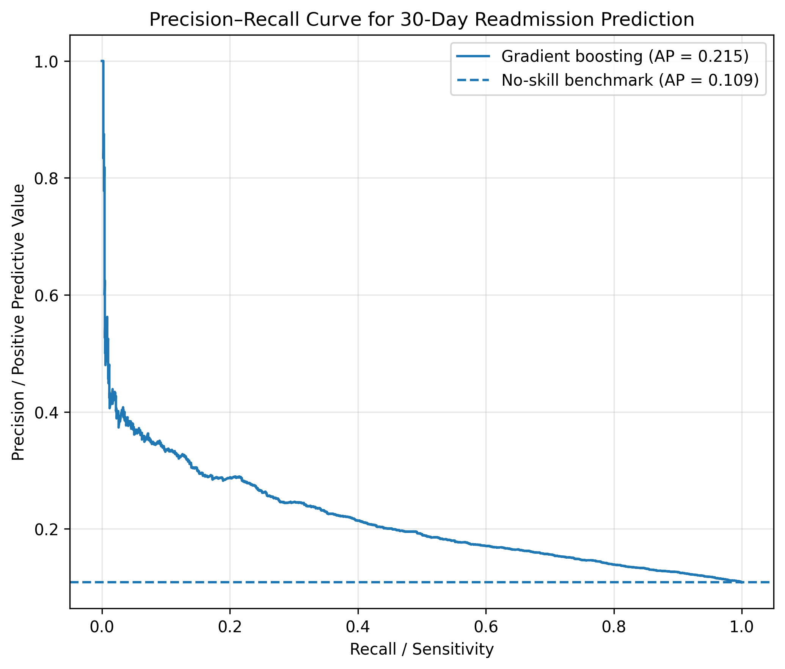
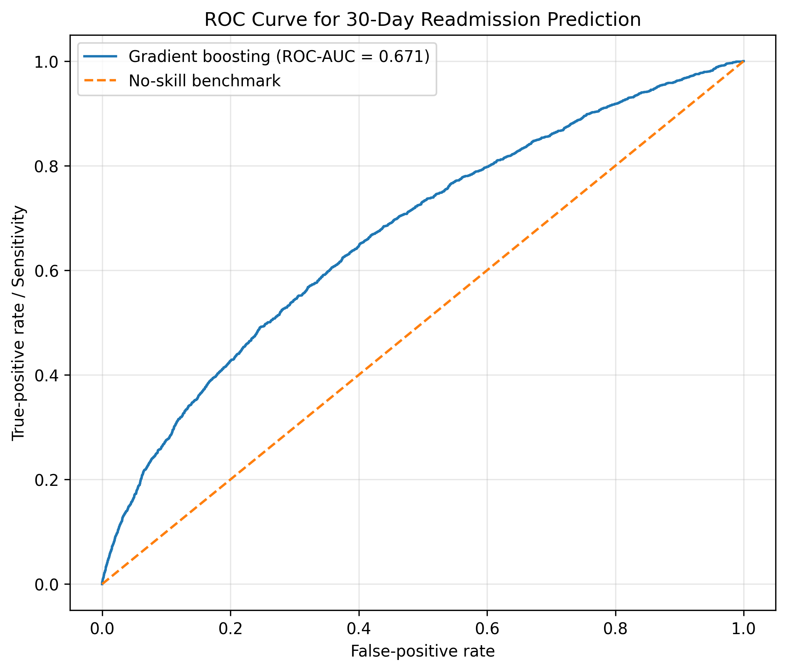

# Predicting 30-Day Hospital Readmission Among Patients With Diabetes
[View the fully rendered Jupyter Notebook](https://nbviewer.org/github/drimransarmad/diabetes-readmission-prediction-python/blob/main/Diabetes_Readmission_Prediction_Project.ipynb)

## Project Overview

This project develops and evaluates an interpretable machine-learning workflow for predicting whether a patient with diabetes will be readmitted to a hospital within 30 days of discharge.

The analysis emphasizes careful validation, patient-level leakage prevention, probability calibration, and clinically interpretable model explanation rather than model complexity alone.

## Dataset

The project uses the **Diabetes 130-US Hospitals for Years 1999–2008** dataset from the UCI Machine Learning Repository.

The original dataset contains:

- 101,766 hospital encounters
- 71,518 unique patients
- Clinical, utilization, diagnosis, medication, and discharge-related variables
- A three-category readmission outcome: `<30`, `>30`, and `NO`

For this project, the target outcome was defined as:

- `1` = readmitted within 30 days
- `0` = not readmitted within 30 days

## Analytical Workflow

The workflow includes:

1. Data loading and initial audit
2. Binary outcome construction
3. Missing-value assessment
4. Patient-level train–test splitting to prevent leakage
5. Clinical eligibility filtering
6. Diagnosis-code grouping
7. Feature encoding and preprocessing
8. Leakage-safe cross-validation
9. Comparison of logistic regression, random forest, and gradient boosting
10. Protected test-set evaluation
11. Probability calibration
12. Risk-threshold selection using development data only
13. Permutation-based predictor importance
14. Clinically interpretable risk summaries with confidence intervals

## Models Compared

| Model | Cross-Validated ROC-AUC |
|---|---:|
| Balanced logistic regression | 0.663 |
| Random forest | 0.670 |
| Gradient boosting | 0.673 |

Gradient boosting provided the strongest overall performance and was selected for final evaluation.

## Protected Test-Set Results

| Metric | Result |
|---|---:|
| ROC-AUC | 0.671 |
| Average precision | 0.215 |
| No-skill average-precision benchmark | 0.109 |
| Calibrated Brier score | 0.093 |
| Calibrated log loss | 0.325 |
| Selected calibrated risk threshold | 0.125 |
| Sensitivity | 0.547 |
| Specificity | 0.696 |
| Balanced accuracy | 0.622 |
| Percentage flagged as higher risk | 33.03% |

## Calibration Insight

The raw class-balanced gradient-boosting probabilities substantially overestimated absolute risk.

Sigmoid calibration improved probability accuracy:

| Measure | Raw probabilities | Calibrated probabilities |
|---|---:|---:|
| Mean predicted probability | 0.451 | 0.114 |
| Observed readmission rate | 0.109 | 0.109 |
| Brier score | 0.217 | 0.093 |
| Log loss | 0.623 | 0.325 |

Calibration improved probability interpretation without changing risk-ranking performance.

## Key Predictive Insights

### Prior Inpatient Utilization

Prior inpatient utilization was the strongest predictor of 30-day readmission risk.

| Prior inpatient encounters | Observed readmission rate |
|---|---:|
| 0 | 8.77% |
| 1 | 14.00% |
| 2 | 20.02% |
| 3 | 22.12% |
| 4 or more | 30.92% |

### Discharge Destination

Discharge destination was the second strongest predictor. Encounters involving rehabilitation or continued institutional care showed higher observed readmission rates than routine discharge to home.
## Publication-Style Figures

### Readmission Risk by Prior Inpatient Utilization

### Readmission Risk by Discharge Destination

### Predictor Importance

### Precision-Recall Curve

### ROC Curve

## Interpretation Boundary

This project demonstrates an interpretable ML workflow for risk stratification.

The findings represent **predictive associations**, not causal effects. The model is a portfolio demonstration and should not be treated as a clinically validated decision tool.

## Tools Used

- Python
- pandas
- NumPy
- matplotlib
- scikit-learn
- Google Colab

## Repository Files

- `Diabetes_Readmission_Prediction_Project.ipynb`
- `readmission_predictor_importance.png`
- `readmission_risk_by_prior_inpatient_utilization_with_ci.png`
- `readmission_risk_by_discharge_destination_with_ci.png`
- `readmission_precision_recall_curve.png`
- `readmission_roc_curve.png`
- `readmission_model_performance_summary.csv`
- `readmission_model_key_findings.csv`

## Professional Positioning

This project supports the following professional positioning:

**PhD Statistical Consultant | Advanced Quantitative Modeling (R, Mplus)**

Supporting capability: interpretable machine learning and reproducible statistical computing in Python.

Professional website: https://drimransarmad.com
